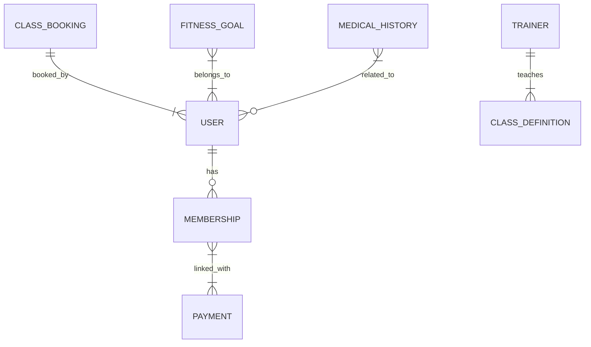

# Gym Management Backend Service

<div align="center">


</div>

## Overview
A robust backend service designed to manage gym operations including membership management, fitness tracking, booking systems, and payment processing. Built using Spring Boot for scalability and reliability, with a microservices architecture approach.

## Technology Stack

### Core Framework
- Spring Boot 3.x
- Spring Web MVC
- Spring Data JPA
- Spring Security

### Database
- PostgreSQL (Primary RDBMS)
- Redis (Caching layer)
- MongoDB (NoSQL for analytical data)

### Infrastructure
- Docker for containerization
- Kubernetes for orchestration
- AWS EC2/Elastic Beanstalk for deployment
- Amazon RDS for database management

### API Documentation
- OpenAPI/Swagger for API documentation
- Spring HATEOAS for RESTful API design

### Testing
- JUnit 5
- Mockito
- Postman for API testing

### CI/CD
- Jenkins/GitHub Actions
- SonarQube for code quality
- Nexus/Artifactory for artifact management

## Features

### 🔐 Authentication & Security
- OAuth2/JWT based authentication
- Role-based access control (RBAC)
- Password encryption using BCrypt
- Rate limiting and API security
- Audit logging for security compliance

### 🏋️‍♂️ Fitness Management
- **Membership Management:**
    - Subscription lifecycle management
    - Membership status tracking API
    - Fitness goal management service
- **Data Analytics:**
    - Historical fitness data storage
    - Progress metrics calculation
    - Achievement badge generation service

### 📅 Booking System
- **Class Management:**
    - Class scheduling API
    - Real-time availability checking
    - Booking conflict resolution
- **Personal Training:**
    - Trainer management service
    - Session customization API
    - Booking status tracking endpoint

### 💳 Payment Integration
- Payment gateway abstraction layer
- Subscription management service
- Stripe/PayPal integration
- Invoice generation API
- Renewal notification service

### ⚙️ System Management
- Health check endpoints
- Monitoring integration (Prometheus/Grafana)
- Logging aggregation (ELK Stack)
- API gateway with Zuul/Netty
- Circuit breaker pattern implementation

## Database Schema



## API Documentation

Available at `/api-docs` endpoint when service is running. Major endpoints include:

- `POST /auth/login` - Authentication endpoint
- `GET /users/{id}/membership` - Membership status
- `POST /bookings/classes` - Class booking
- `GET /analytics/progress` - Fitness progress data
- `POST /payments/process` - Payment processing

## Development Setup

### Prerequisites
- Java 17+
- Maven 3.8+
- Docker
- PostgreSQL

### Local Development
```bash
# Clone repository
git clone https://github.com/AminElhag/crispy-goggles-backend.git

# Build project
mvn clean install

# Run application
mvn spring-boot:run

# Run tests
mvn test
```

## Deployment

### Docker Instructions
```bash
# Build docker image
docker build -t gym-backend .

# Run container
docker run -p 8080:8080 -e SPRING_PROFILES_ACTIVE=prod gym-backend
```

### Kubernetes Deployment
```yaml
apiVersion: apps/v1
kind: Deployment
metadata:
  name: gym-backend
spec:
  replicas: 3
  selector:
    matchLabels:
      app: gym-backend
  template:
    metadata:
      labels:
        app: gym-backend
    spec:
      containers:
      - name: gym-backend
        image: gym-backend:latest
        ports:
        - containerPort: 8080
        env:
        - name: SPRING_PROFILES_ACTIVE
          value: "prod"
```

## Contributing

We welcome contributions to improve the backend service! Please follow these steps:

1. Fork the project
2. Create your feature branch (`git checkout -b feature/backend-improvement`)
3. Commit your changes (`git commit -m 'Add backend improvement'`)
4. Push to the branch (`git push origin feature/backend-improvement`)
5. Open a pull request with detailed description

## License

Distributed under the MIT License. See `LICENSE` for more information.

---

**Contact**  
Backend Lead: [Amin Elhag](mailto:amingalalelhag@gmail.com)  
Project Repository: [github.com/AminElhag/crispy-goggles-backend](https://github.com/AminElhag/crispy-goggles-backend)  

**Note:** This backend service is designed to be consumed by mobile clients, web applications, and other backend services through its comprehensive RESTful API.
